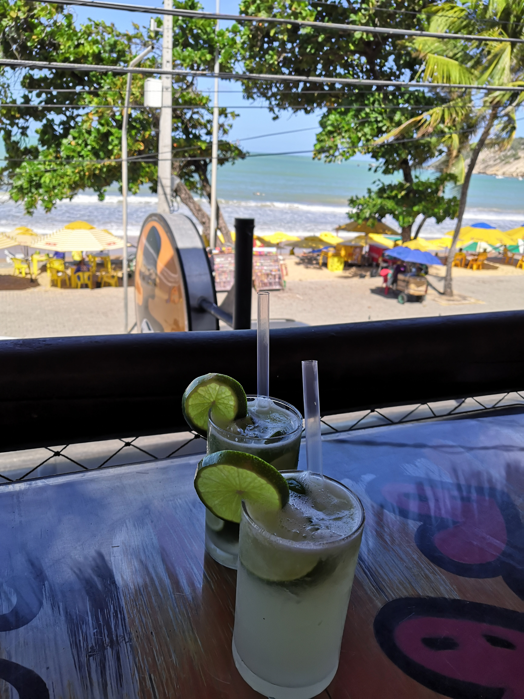
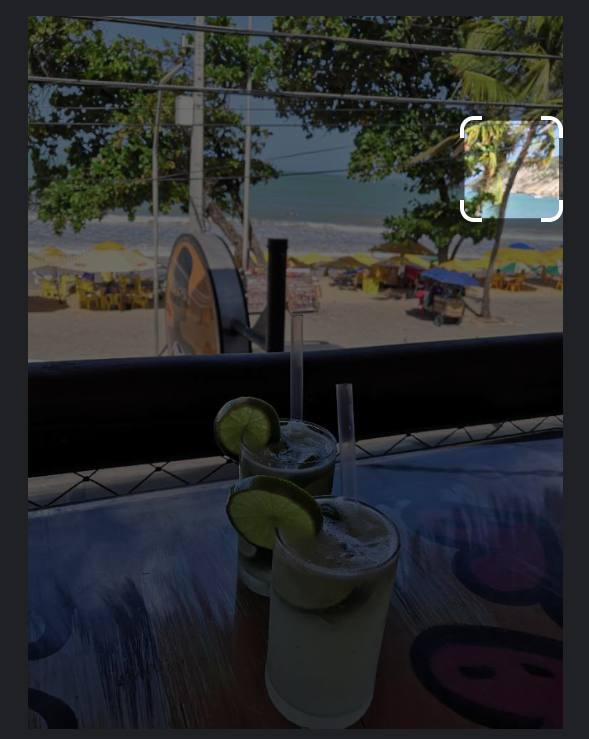
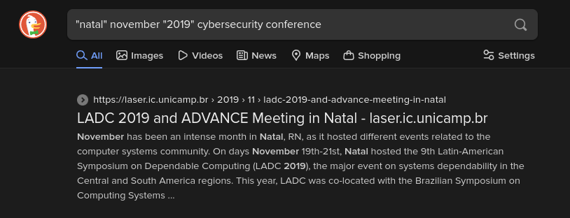

# Hangover (Write-Up)

> OSINT challenge from the GreHack CTF 2023.

## Challenge description

We need to find the full name of a cybersecurity conference that took place at the same time and place as the following picture :

## Solution

### Step 1 : Find the location

Using [Google Lens](https://lens.google.com/), we can find the city where the picture was taken thanks to similarities in the vegetation of the cliff in the top left corner of the picture.

The vegetation in the first result looks very similar, so we can assume that the picture was taken in the city of **Natal**, in Brazil.

### Step 2 : Find the date

Since the picture's name is `IMG_20191120_135304.jpg`, we can assume that it was taken on the 20th of November 2019.

### Step 3 : Find the conference

We can now search for a cybersecurity conference that took place in Natal on the 20th of November 2019 :

The first result is the **9th Latin-American Symposium on Dependable Computing**.

This gives us the flag : `GH{9th_latin-american_symposium_on_dependable_computing}`.

